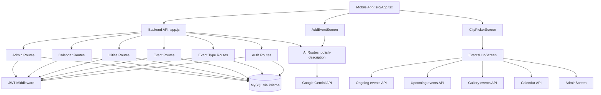
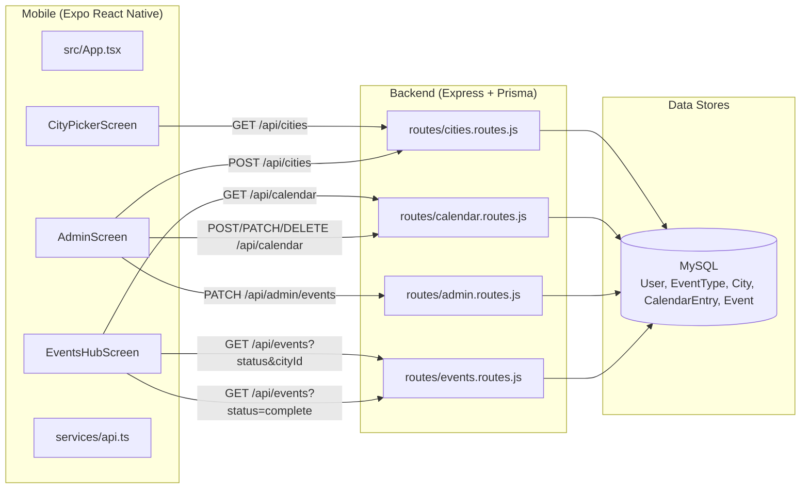

# Repository Mental Map

This file is the living map of the codebase structure and module relationships.

## High-Level Topology

```text
captureAkanksha/
├── backend/                  # Node.js + Express API
│   ├── prisma/
│   │   └── schema.prisma     # MySQL: CostCenter, Donor, Event+type+status, CalendarEntry, City
│   ├── src/
│   │   ├── app.js            # Express app wiring and route mounting
│   │   ├── server.js         # Process entrypoint
│   │   ├── lib/
│   │   │   ├── prisma.js
│   │   │   ├── allowedMedia.js
│   │   │   ├── publicApiBase.js   # PUBLIC_API_BASE_URL / Host for absolute links
│   │   │   └── resolveMediaUrl.js # Rewrite loopback media URLs for client devices
│   │   ├── middleware/
│   │   │   └── auth.js       # JWT auth + role checks (admin)
│   │   ├── routes/
│   │   │   ├── auth.routes.js
│   │   │   ├── ai.routes.js        # POST /polish-description → Gemini (GOOGLE_AI_API_KEY)
│   │   │   ├── events.routes.js    # CRUD + filters (city, status, gallery)
│   │   │   ├── types.routes.js
│   │   │   ├── cities.routes.js        # City list + admin CRUD
│   │   │   ├── costCenters.routes.js   # Cost center list + admin CRUD
│   │   │   ├── donors.routes.js        # Donors per cost center (admin)
│   │   │   ├── calendar.routes.js      # Calendar scoped by costCenterId
│   │   │   ├── notifications.routes.js # Queue donor notifications
│   │   │   └── admin.routes.js         # Moderation + notify donors per event
│   │   ├── services/
│   │   │   ├── drive.js
│   │   │   ├── localMediaStorage.js
│   │   │   ├── mediaUpload.js
│   │   │   └── googleAuth.js
│   │   ├── constants/
│   │   │   └── allowedCities.js  # Mumbai, Pune, Nagpur allowlist
│   │   └── scripts/
│   │       ├── seed.js                # Base seed: event types + cities
│   │       ├── seedDummyData.js       # Preview dataset → LocalDB (CC, donors, events, calendar)
│   │       └── backfillEventCityIds.js  # Set event.cityId from cost center when null
│   ├── uploads/
│   ├── package.json
│   └── .env.example
├── client/                   # Expo React Native app (BookMyShow-style flow)
│   ├── App.tsx
│   ├── app.json
│   ├── metro.config.js       # Extends expo/metro-config (expo-doctor)
│   ├── eas.json
│   ├── android/              # Native project (expo prebuild / run:android)
│   ├── ios/
│   ├── index.ts
│   ├── src/
│   │   ├── App.tsx           # Auth + session bootstrap
│   │   ├── config/constants.ts
│   │   ├── config/cities.ts      # Allowed city filter (Mumbai, Pune, Nagpur)
│   │   ├── data/
│   │   │   ├── dummyHubData.ts   # Optional preview events/calendar per cost center (USE_DUMMY_HUB_DATA)
│   │   │   └── dummyGalleryEvents.ts
│   │   ├── theme/theme.ts    # Brand palette (BMS-inspired red + accent gold)
│   │   ├── components/
│   │   │   ├── EventCalendar.tsx
│   │   │   ├── EventPosterCard.tsx
│   │   │   └── ...
│   │   ├── screens/
│   │   │   ├── CostCenterPickerScreen.tsx  # Cost centers grouped by city (hub entry)
│   │   │   ├── EventsHubScreen.tsx    # Feed | Ongoing | Upcoming | CaptureAkanksha | Calendar
│   │   │   ├── AddEventScreen.tsx
│   │   │   ├── AdminScreen.tsx        # Admin-only moderation + calendar + cities
│   │   │   ├── HomeScreen.tsx         # City picker → cost center picker → hub
│   │   │   └── LoginScreen.tsx
│   │   ├── services/api.ts
│   │   ├── types/app.ts
│   │   └── utils/
│   │       ├── costCenterGrouping.ts
│   │       ├── eventGrouping.ts
│   │       ├── locationCity.ts       # City bounds, sort cities/events by detected city
│   │       └── mediaUrl.ts         # Client-side loopback → API_BASE_URL rewrite
│   ├── scripts/
│   │   ├── print-api-setup.mjs
│   │   ├── print-ngrok-setup.mjs   # npm run api:ngrok
│   │   └── sync-ngrok-api-url.mjs  # npm run api:sync-ngrok → client + backend .env
│   ├── vercel.json           # Frontend-only Vercel (Root Directory = client)
│   └── package.json            # build:web → expo export --platform web → dist/
├── api/
│   └── index.js              # Vercel serverless entry → backend/src/app.js
├── vercel.json               # Full-stack Vercel: web export + API rewrites
├── package.json              # tunnel:ngrok, vercel-build, build:web
├── README.md
└── REPO_MAP.md
```

## Runtime Relationship Graph



## Application Knowledge Graph



## Data Flow Snapshot

1. User signs in with Google; backend returns JWT.
2. Mobile loads cost centers (`GET /api/cost-centers`) synced from `Finance.costcenter` (only rows with a city that exists in `City` table).
3. **Cost center picker**: user selects a cost center (each has registered donors).
4. **Events hub** for that cost center (event **type** still applies per event):
   - **Feed** shows all city events in a vertical stream (`GET /api/events?cityId`)
   - **Ongoing** / **Upcoming** / **CaptureAkanksha** / **Calendar** — all filtered by `costCenterId` (capture remains city-scoped)
   - CaptureAkanksha: `GET /api/events?cityId=&status=complete` (all completed events in the selected city, including via cost center), grouped by date and location; gallery-approved items show a badge
5. Upload: `POST /api/events` requires `costCenterId` + `typeId`; optional `cityId` for venue.
6. Media links: `GET /api/events` and `GET /api/events/grouped` rewrite loopback `mediaUrl` values via `resolveMediaUrl.js` (and mobile `utils/mediaUrl.ts` as a fallback).
7. **Admin** can moderate events, approve gallery, **Notify donors** (`POST /api/admin/events/:id/notify-donors`), and manage calendar entries per cost center.

## LocalDB dummy seed

- `npm run db:seed:dummy` — syncs `Finance.costcenter` → `CostCenter`, then seeds preview `Event` / `CalendarEntry` / `Donor` rows keyed by Finance `costcenter` name (not `ccCode`)
- `npm run db:seed:all` — runs base `seed.js` then `seedDummyData.js`
- Only Finance rows with a city that exists in `City` are synced; seed events reference names like `ASE Mumbai`, `ANWEMS`, `Coaches - Pune`

## Map Update Protocol

- Update this file when adding/removing routes, services, models, storage targets, or external integrations.
- Keep both graph views aligned: `Runtime Relationship Graph` and `Application Knowledge Graph`.
