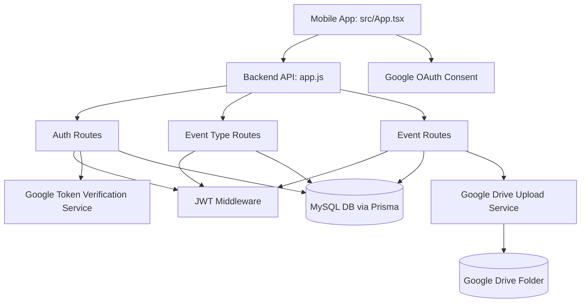

# Repository Mental Map

This file is the living map of the codebase structure and module relationships.

## High-Level Topology

```text
captureAkanksha/
├── backend/                  # Node.js + Express API
│   ├── prisma/
│   │   └── schema.prisma     # MySQL Prisma models (User, EventType, Event)
│   ├── src/
│   │   ├── app.js            # Express app wiring and route mounting
│   │   ├── server.js         # Process entrypoint
│   │   ├── lib/
│   │   │   └── prisma.js     # Prisma client singleton
│   │   ├── middleware/
│   │   │   └── auth.js       # JWT auth + role checks
│   │   ├── routes/
│   │   │   ├── auth.routes.js
│   │   │   ├── events.routes.js
│   │   │   └── types.routes.js
│   │   ├── services/
│   │   │   ├── drive.js      # Google Drive upload integration
│   │   │   └── googleAuth.js # Google ID token verification
│   │   └── scripts/
│   │       └── seed.js       # Seed event types
│   ├── package.json
│   └── .env.example
├── mobile/                   # Expo React Native app
│   ├── App.tsx               # Thin entrypoint re-exporting src/App
│   ├── index.ts              # App registration
│   ├── app.json
│   ├── eas.json              # EAS cloud build profiles
│   ├── src/
│   │   ├── App.tsx           # Root functional app orchestrator
│   │   ├── config/
│   │   │   └── constants.ts  # API and OAuth constants
│   │   ├── components/
│   │   │   ├── AppButton.tsx
│   │   │   ├── AppCard.tsx
│   │   │   ├── FormField.tsx
│   │   │   ├── ScreenHeader.tsx
│   │   │   ├── SelectChip.tsx
│   │   │   └── index.ts       # Barrel export for component imports
│   │   ├── hooks/
│   │   │   └── useAppRoute.ts
│   │   ├── screens/
│   │   │   ├── HomeScreen.tsx
│   │   │   ├── LoginScreen.tsx
│   │   │   └── NotFoundScreen.tsx
│   │   ├── services/
│   │   │   └── api.ts        # Typed API client helpers
│   │   ├── types/
│   │   │   └── app.ts
│   │   └── utils/
│   │       └── routing.ts
│   ├── tsconfig.json
│   └── package.json
├── .cursor/
│   └── rules/
│       └── repo-map-maintenance.mdc
├── package.json              # Root common dev/start scripts
├── package-lock.json
├── README.md
├── .gitignore
└── REPO_MAP.md
```

## Runtime Relationship Graph



## Data Flow Snapshot

1. User signs in with Google from `mobile/src/screens/LoginScreen.tsx`.
2. Mobile sends Google ID token to `/api/auth/google`.
3. Backend verifies token, enforces allowed email domain, and upserts user in SQL.
4. Backend returns JWT for API access.
5. Mobile calls `/api/types` and `/api/events` with Bearer token.
6. User captures photo/video and uploads to `/api/events`.
7. Backend uploads media to Google Drive and stores event metadata in SQL.
8. Mobile renders events grouped by type and date.

## Current Gaps to Track

- Build/release credentials for EAS Android and iOS test builds still need account setup.
