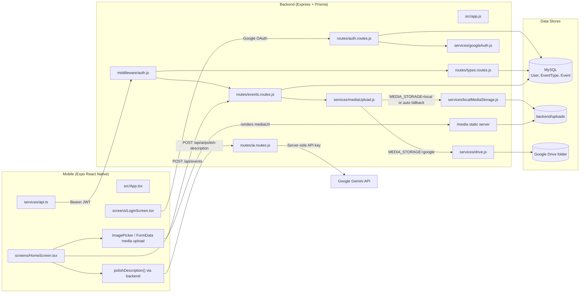

# Repository Mental Map

This file is the living map of the codebase structure and module relationships.

## High-Level Topology

```text
captureAkanksha/
├── backend/                  # Node.js + Express API
│   ├── prisma/
│   │   └── schema.prisma     # MySQL Prisma models (User, EventType, Event with uploader-name snapshot)
│   ├── src/
│   │   ├── app.js            # Express app wiring and route mounting
│   │   ├── server.js         # Process entrypoint
│   │   ├── lib/
│   │   │   ├── prisma.js        # Prisma client singleton
│   │   │   ├── allowedMedia.js  # MIME/extension allowlist for uploads + filenames
│   │   │   └── publicApiBase.js # Resolve PUBLIC_API_BASE_URL vs Host vs 127.0.0.1 fallback
│   │   ├── middleware/
│   │   │   └── auth.js       # JWT auth + role checks
│   │   ├── routes/
│   │   │   ├── auth.routes.js
│   │   │   ├── ai.routes.js       # Auth-protected Gemini description polish endpoint
│   │   │   ├── events.routes.js
│   │   │   └── types.routes.js
│   │   ├── services/
│   │   │   ├── drive.js           # Google Drive client + upload
│   │   │   ├── localMediaStorage.js # Dev/disk saves under backend/uploads
│   │   │   ├── mediaUpload.js     # MEDIA_STORAGE auto|google|local router
│   │   │   └── googleAuth.js      # Google ID token verification
│   │   └── scripts/
│   │       └── seed.js       # Seed event types
│   ├── uploads/              # Local media files (gitignored; created at runtime)
│   ├── package.json
│   └── .env.example
├── mobile/                   # Expo React Native app
│   ├── App.tsx               # Thin entrypoint re-exporting src/App
│   ├── index.ts              # App registration
│   ├── app.json              # Expo config (logo used for app icon/adaptive/favicon; adaptive background set to black)
│   ├── eas.json              # EAS cloud build profiles
│   ├── src/
│   │   ├── App.tsx           # Root functional app orchestrator
│   │   ├── config/
│   │   │   └── constants.ts  # API and OAuth constants
│   │   ├── components/
│   │   │   ├── AppButton.tsx   # Themed button with optional Ionicon
│   │   │   ├── AppCard.tsx
│   │   │   ├── FormField.tsx   # Themed text input field
│   │   │   ├── ScreenHeader.tsx # Home header with contextual welcome text
│   │   │   ├── SelectChip.tsx  # Themed chip selector with optional icon
│   │   │   └── index.ts       # Barrel export for component imports
│   │   ├── hooks/
│   │   │   └── useAppRoute.ts
│   │   ├── screens/
│   │   │   ├── HomeScreen.tsx  # Three-tab home (Add form + View/Likes feed + Profile/logout)
│   │   │   ├── LoginScreen.tsx
│   │   │   └── NotFoundScreen.tsx
│   │   ├── services/
│   │   │   └── api.ts        # Typed API client helpers (auth, events, AI polish via backend)
│   │   ├── types/
│   │   │   └── app.ts
│   │   └── utils/
│   │       └── routing.ts
│   ├── tsconfig.json
│   └── package.json
├── .cursor/
│   └── rules/
│       └── repo-map-maintenance.mdc
├── package.json              # Root common dev/start scripts
├── package-lock.json
├── README.md
├── .gitignore
└── REPO_MAP.md
```

## Runtime Relationship Graph

```mermaid
graph TD
  A[Mobile App: src/App.tsx] --> B[Backend API: app.js]
  A --> A1[HomeScreen Tabs: Add | View]
  A1 --> A2[Local Like State]
  A --> K[Google OAuth Consent]
  B --> C[Auth Routes]
  B --> D[Event Type Routes]
  B --> E[Event Routes]
  B --> X[AI Routes]
  C --> F[JWT Middleware]
  D --> F
  E --> F
  X --> F
  C --> G[Google Token Verification Service]
  C --> H[(MySQL DB via Prisma)]
  D --> H
  E --> H
  E --> I[Media Upload: mediaUpload.js]
  I --> I1[Drive Service]
  I --> I2[Local Disk /media Static]
  I1 --> J[(Google Drive Folder)]
  I2 --> I3[(backend/uploads)]
```

## Application Knowledge Graph



## Auth Knowledge Graph

```mermaid
graph TD
  U[User] --> L[LoginScreen: Continue with Google]
  L --> A[App.tsx promptAsync()]
  A --> G[Google OAuth]
  G --> R[Auth response with id_token]
  R --> S[POST /api/auth/google]
  S --> AR[auth.routes.js]
  AR --> GS[googleAuth.verifyGoogleIdToken]
  GS --> D[(MySQL User via Prisma upsert)]
  AR --> J[JWT sign]
  J --> T[Mobile token state]
  T --> P[Authorization: Bearer token]
  P --> M[requireAuth middleware]
  M --> E[/api/events]
  M --> TY[/api/types]
```

## Event Upload and View Graph

```mermaid
graph TD
  H[HomeScreen Add Tab] --> C[Capture media via ImagePicker]
  C --> F[FormData: caption, typeId, eventDate, mediaType, media]
  F --> U[POST /api/events]
  U --> ER[events.routes.js]
  ER --> V[Validate payload + file + type existence]
  V --> MU[mediaUpload.uploadEventMedia]
  MU -->|MEDIA_STORAGE=google| DR[drive.uploadToGoogleDrive]
  MU -->|MEDIA_STORAGE=local| LS[localMediaStorage.saveLocalMedia]
  MU -->|MEDIA_STORAGE=auto + Drive configured| DR
  MU -->|MEDIA_STORAGE=auto + Drive missing| LS
  DR --> GD[(Google Drive folder)]
  LS --> LD[(backend/uploads)]
  LD --> MS[/media static route]
  ER --> DB[(MySQL Event row)]
  DB --> Q[GET /api/events]
  Q --> HV[HomeScreen View Tab]
  HV --> IM[Photo preview via mediaUrl]
  HV --> LK[Local like toggle state]
```

## Data Flow Snapshot

1. User lands on branded login (`mobile/src/screens/LoginScreen.tsx`) with top Akanksha logo and Google-only sign-in CTA.
2. Mobile sends Google ID token to `/api/auth/google`.
3. Backend verifies token, enforces allowed email domain, and upserts user in SQL.
4. Backend returns JWT for API access.
5. Mobile calls `/api/types` and `/api/events` with Bearer token.
6. User captures photo/video and uploads to `/api/events`.
7. Backend stores media via `mediaUpload.js`: `MEDIA_STORAGE=auto` uses Drive when service account + folder are valid, otherwise saves under `backend/uploads` and serves files at `GET /media/...`; `google` / `local` force one backend.
8. In `Add` tab, mobile sends description to `/api/ai/polish-description`; backend calls Gemini with `GOOGLE_AI_API_KEY` and returns polished text.
9. Mobile captures media and submits full event details (title, description/caption, type, date, mediaType, media file); backend stores title, caption, uploader user id, and uploader name snapshot on each Event.
10. In `View` tab, mobile renders events grouped by type/date, shows creator + upload timestamp metadata per card, and supports client-side like toggles per event.
11. In `Profile` tab, mobile shows user identity and quick stats, and the logout action lives here (not in the header/nav shortcut).
12. Core mobile UI components (`AppButton`, `SelectChip`, `FormField`, `AppCard`, `ScreenHeader`) switch styling by system color scheme (light/dark) and expose icon-driven actions.

## Current Gaps to Track

- Build/release credentials for EAS Android and iOS test builds still need account setup.

## Map Update Protocol

- Update this file when adding/removing routes, services, models, storage targets, or external integrations.
- Keep both graph views aligned: `Runtime Relationship Graph` and `Application Knowledge Graph`.
- Reflect new media/auth/data paths in `Data Flow Snapshot` immediately in the same PR/session.
